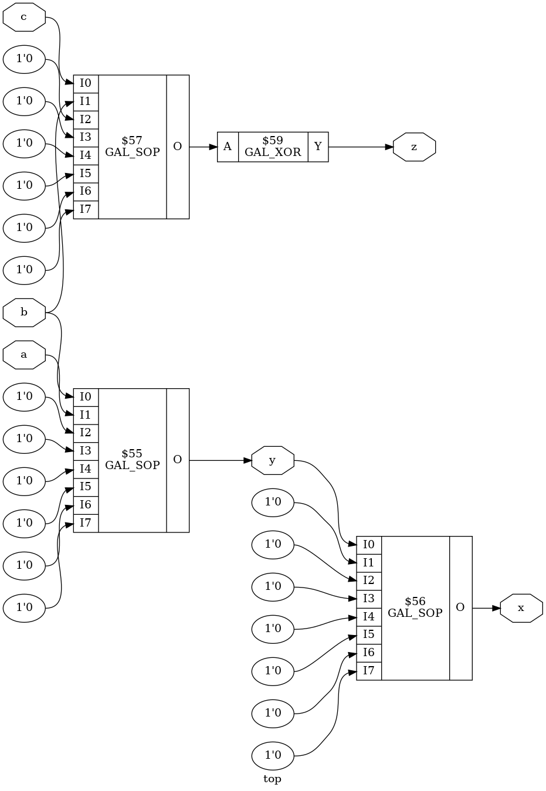

# ReGAL

[](https://travis-ci.com/psurply/ReGAL)

ReGAL is a set of scripts used to assist reverse engineering of old-school
*Programmable Array Logic* devices.

## Synthesis / Place-and-route

From verilog design, ReGAL can generate JEDEC files that can be used to program
*Generic Array Logic* devices.

The synthesis is assisted by Yosys while the place-and-route logic has been
implemented from scratch (since trivial for this type of devices).

As an example, consider the following design:

```verilog
module top (
    input a, b, c,
    output x, y, z
);

assign x = a ^ b;
assign y = ~x;
assign z = ~(c & b);

endmodule
```

From this verilog file, the netlist can be generated using the `synth`
subcommand. Internally, this command defines the GAL logic cells and configures
Yosys to parse the design file, apply high-level optimizations, perform the
technology mapping and output the netlist as a JSON file:

```console
$ regal synth -o netlist.json basic.v
```



A JEDEC file is obtained from this netlist using the `pnr` subcommand. This
step requires to specify the targeted device and the IO mapping.

```yaml
device: GAL16V8
mode: simple
pins:
    a: 1
    b: 2
    c: 3

    x: 19
    y: 18
    z: 17
```

```console
$ regal pnr -o basic.jed device.yaml netlist.json
```

The `build` subcommand combines the synthesis and the place-and-route in only
one step:

```console
$ regal build -o basic.jed device.yaml basic.v
```

It is also allowed to synthesize sequential designs if the device has been
configured in registered mode in the place-and-route configuration file:

```yaml
device: GAL16V8
mode: registered
pins:
    Clk: 1
    A: 2
    B: 3

    X: 19
    Clk2: 17
```

Due to the limitations of GAL devices, the design can only define sequential
logic on the positive edge of the dedicated clock input (Pin 1 for GAL16V8):

```verilog
module top (
    input Clk,
    input A,
    input B,

    output X,
    output reg Clk2
);

assign X = A ^ B;

always @(posedge Clk)
  Clk2 <= ~Clk2
;

endmodule
```


### Supported devices

- GAL16V8 (simple, complex and registered mode)
- GAL20V8 (simple mode only)

## Reverse engineering locked PAL/GAL

Another aspect of this project consists in facilitate the reproduction of
locked PAL devices.
When the fuse map is not readable anymore using the standard programming
method, one alternative consists in dumping the truth tables by probing the
outputs of the device when applying all the possibles input combinations.

Obliviously, this method is limited to devices implementing combinational
logic (PAL working in registered mode are out-of-scope for this
proof-of-concept).

The current implementation uses an arduino mega to drive the device under test.
The setup required to perform the IO probing on the example defined above can
be described as follow:

```yaml
probe: arduino_mega
outfile: basic_tt.csv
device: /dev/ttyUSB0

ios:
    inputs:
        - a: C0
        - b: C1
        - c: C2

    outputs:
        - x: A0
        - y: A1
        - z: A2
```

```console
$ regal dump dump.yaml
```

While controlling the probe device, the `dump` subcommand produces the
truth-table as a CSV file:

```csv
a,b,c,,x,y,z
0,0,0,,0,1,1
1,0,0,,1,0,1
0,1,0,,1,0,1
1,1,0,,0,1,1
0,0,1,,0,1,1
1,0,1,,1,0,1
0,1,1,,1,0,0
1,1,1,,0,1,0
```

Once the truth-table extracted, it can be simplified and converted to a verilog
file with the `tt2v` subcommand:

```console
$ regal tt2v basic_tt.csv basic_from_tt.v
```

The produced verilog is similar to the one used for the synthesis and can be
used to generate a new JEDEC file equivalent to the original one.

```verilog
module top (
    input a,
    input b,
    input c,
    output x,
    output y,
    output z
);

assign x =
  (~a & b) |
  (a & ~b)
;

assign y =
  (~a & ~b) |
  (a & b)
;

assign z =
  (~c) |
  (~b)
;

endmodule
```

## Installation

```console
$ pip install ./ --user
```

### Requirements

- [yosys](https://github.com/YosysHQ/yosys)
- [quine-mccluskey](https://github.com/tpircher/quine-mccluskey)
